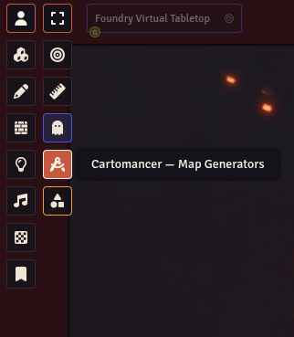
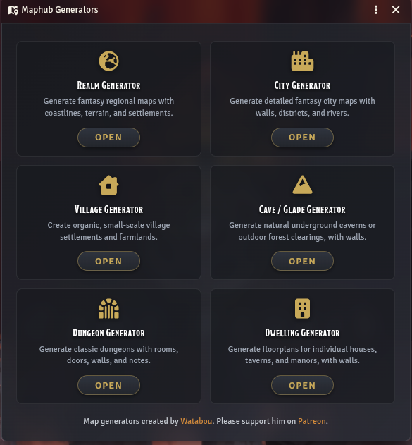

# Cartomancer — Map Generators

Cartomancer runs Watabou's map generators inside Foundry VTT and imports the result into your world. It is system-agnostic and GM-only: use it to turn generated dungeons, caves, dwellings, realms, cities, and villages into Foundry scenes, then keep working in Foundry instead of downloading files and rebuilding maps by hand.

The module is built around a practical distinction:

- Tactical maps become playable scenes with Foundry data where possible: grids, walls, doors, levels, and stair regions.
- Region and settlement maps become clean handout/overview scenes, with realm maps optionally aligned to a Foundry flat-top hex grid for hexcrawls.

Watabou's generators are made by Oleg Dolya / [Watabou](https://watabou.itch.io) Please support his [Patreon](https://www.patreon.com/cw/watawatabou)

## Demo

<video src="https://github.com/user-attachments/assets/b612caf1-fde3-433b-9c1f-d81cdb2886ac" controls muted loop playsinline width="720">
  <a href="https://github.com/user-attachments/assets/b612caf1-fde3-433b-9c1f-d81cdb2886ac">▶ Watch the Cartomancer demo</a>
</video>

## Features

- Run six Watabou generators from a Foundry ApplicationV2 window:
  - Perilous Shores / Realm
  - Medieval Fantasy City
  - Village
  - Cave / Glade
  - One Page Dungeon
  - Dwellings
- Import tactical maps as Foundry scenes:
  - One Page Dungeon: square grid, walls, doors, fog and token vision.
  - Cave / Glade: square grid, wall geometry, fog and token vision.
  - Dwellings: multi-level scene with one Foundry Level per floor, per-level walls and doors, and stair regions linking floors.
- Import overview maps as handouts:
  - Perilous Shores: flat-top hex scene aligned so one Foundry hex matches one drawn map hex; fully revealed for hexcrawling.
  - Medieval Fantasy City and Village: gridless, fully revealed image scenes for settlement overviews.
- Preserve manual edits in the live generator window when importing.
- Open Perilous Shores realms as a Foundry folder: realm scene, Note pins, cross-linked Journal entries, and on-demand generated location maps.
- Download generator code on first use into local Foundry data so the generators run same-origin, locally, and offline after the initial download.
- Import DungeonDraft `.dungeondraft_pack` object packs and place their decor on scenes as tiles.

## Compatibility

| Item               | Status                                                 |
| ------------------ | ------------------------------------------------------ |
| Foundry VTT        | Minimum v13, verified v14                              |
| Game systems       | System-agnostic; no game system dependency is declared |
| Required modules   | None                                                   |
| User permissions   | GM-only tools                                          |
| Included compendia | None                                                   |
| Route prefix       | Supported — generators work when Foundry is served under a route prefix (reverse-proxy subpath) |

Cartomancer relies on Foundry's modern ApplicationV2 APIs and v13/v14 scene APIs. It is developed directly as a Foundry module in `Data/modules/cartomancer`.

### Install by manifest URL

In Foundry's **Add-on Modules → Install Module** dialog, paste:

```text
https://github.com/DimitroffVodka/cartomancer/releases/latest/download/module.json
```

Then enable **Cartomancer — Map Generators** in your world.

### Manual installation

1. Download `module.zip` from the latest GitHub release.
2. Extract it to `Data/modules/cartomancer/`.
3. Restart Foundry.
4. Enable the module in your world.

## Quick start: import a map

1. Log in as a GM.
2. Open a world and activate any scene.
3. In the left Scene Controls, use the Tokens controls group and click **Cartomancer — Map Generators** (drafting-compass icon).

   

4. Choose a generator.
5. Adjust the map in the generator window. The guides in `docs/generators/` explain the right-click menus, keyboard shortcuts, and recommended settings.
6. Click the visible **Import Scene** button in the generator window header.
7. Open the new scene and check the grid, walls, doors, levels, or handout image.



The generator window also has header actions for **Set as BG**, **Add as Tile**, **Show to Players**, **Export to Chat**, and **Save Map State**.

## Generator import guide

The full generator documentation lives in `docs/generators/`:

| Generator               | Cartomancer output                                                                                | Usage guide                                                                          |
| ----------------------- | ------------------------------------------------------------------------------------------------- | ------------------------------------------------------------------------------------ |
| Perilous Shores / Realm | Flat-top hex hexcrawl scene, fully revealed. Optional realm-folder import with journals and pins. | [docs/generators/perilous-shores.md](docs/generators/perilous-shores.md)             |
| Medieval Fantasy City   | Gridless, fully revealed city handout scene.                                                      | [docs/generators/medieval-fantasy-city.md](docs/generators/medieval-fantasy-city.md) |
| Village                 | Gridless, fully revealed village handout scene.                                                   | [docs/generators/village.md](docs/generators/village.md)                             |
| Cave / Glade            | Square-grid tactical scene with wall geometry.                                                    | [docs/generators/cave-glade.md](docs/generators/cave-glade.md)                       |
| One Page Dungeon        | Square-grid tactical scene with walls and doors. Supports normal and Small Tiles density.         | [docs/generators/one-page-dungeon.md](docs/generators/one-page-dungeon.md)           |
| Dwellings               | Multi-level tactical scene with floor backgrounds, walls, doors, and stair regions.               | [docs/generators/dwellings.md](docs/generators/dwellings.md)                         |

Recommended settings in brief:

- Realm: Cartomancer forces flat-top hexes for import. Use a large or huge size preset before generating for a sharper hexcrawl map.
- City: Frame the whole city and keep scale bar, compass, and grid overlays off for a clean handout.
- Village: Use a larger size tag for detail; hide the title plate if you do not want it baked into the scene image.
- Cave / Glade: Use Square grid in the generator so the drawn grid and Foundry grid agree.
- One Page Dungeon: Leave notes/title/story overlays off if you do not want text baked into the captured background. Use Small Tiles only when you want half-size Foundry cells.
- Dwellings: Stay in Plan view. Cartomancer defaults the generator to Double Grid and imports every generated floor.

## Local generator downloads

Scene import requires the generator to run same-origin with Foundry. Hosted `watabou.github.io` pages are useful for viewing, but cross-origin browser rules prevent Cartomancer from reading their canvas and geometry for full import.

Cartomancer therefore uses a local path:

- **Settings → Configure Settings → Module Settings → Cartomancer → Download Generators** downloads Watabou's generator files from `watabou.github.io` into your Foundry data folder.
- The one-time download is roughly 1-1.5 MB per generator.
- After download, the generator runs locally and offline with import features intact.
- If a generator has not been downloaded, Cartomancer prompts for the download when you open it.

## DungeonDraft decor packs

Cartomancer can import DungeonDraft `.dungeondraft_pack` object packs for scene decoration. No art packs are bundled.

### Import packs

1. Open **Settings → Configure Settings → Module Settings → Cartomancer → DungeonDraft Decor Packs → Manage Packs**.
2. Choose **Add Pack** for a local `.dungeondraft_pack`, or **Import from URL** for a direct downloadable file URL.
3. In the preview window, select individual assets, categories, or extract everything.

Login-gated store links usually cannot be fetched directly by Foundry. Download those files yourself and use **Add Pack**.

### Place decor

1. In Scene Controls, use the Tokens controls group and click **Cartomancer — Decor Browser** (shapes icon).
2. Browse or search the imported pack tree.
3. Drag a thumbnail onto the scene, or click a thumbnail and use **Place at view**.
4. Adjust scale, elevation, and grid snapping in the Decor Browser toolbar.

Imported packs live under Foundry `Data/decor/ddpacks/` (user-data level, shared by every world). Each pack carries its own `_index.json` holding its metadata plus enabled/removed state, and the registry is derived from those files rather than from a world setting — so a pack imported in one world is available in all of them and never needs re-uploading. Removing a pack is a soft-delete: it is hidden everywhere, but the extracted textures stay on disk.

## Configuration

| Setting or menu                                                                 | Default | Scope         | What it does                                                                                                                                                                 |
| ------------------------------------------------------------------------------- | ------- | ------------- | ---------------------------------------------------------------------------------------------------------------------------------------------------------------------------- |
| **Use bundled (local) generators** (`cartomancer.settlement.useLocalMaphub`)    | On      | World         | Runs local same-origin generators. Required for scene, wall, level, and geometry import. Turning it off loads hosted Watabou pages as view-only.                             |
| **Open generators in a detached window** (`cartomancer.openGeneratorsDetached`) | Off     | Client        | Opens each generator in its own window instead of docking inside Foundry. Useful if Foundry's detach control would otherwise rebuild the iframe after you have edited a map. |
| **DungeonDraft Decor Packs → Manage Packs**                                     | n/a     | GM menu       | Opens the pack importer/manager.                                                                                                                                             |
| **Map Generators → Download Generators**                                        | n/a     | GM menu       | Downloads Watabou generator files into local Foundry data for same-origin/offline use.                                                                                       |

## API and macro entry points

Cartomancer exposes a small API for GM macros and debugging:

```js
const api = game.modules.get("cartomancer")?.api;
await api.openLauncher();
```

| API function                                | Purpose                                                                                                       |
| ------------------------------------------- | ------------------------------------------------------------------------------------------------------------- |
| `openLauncher()`                            | Open the map-generator launcher.                                                                              |
| `openDDPackSettings()`                      | Open the DungeonDraft decor pack manager.                                                                     |
| `openDecorBrowser()`                        | Open the decor browser.                                                                                       |
| `openGeneratorDownloader()`                 | Open the generator download dialog.                                                                           |
| `importRealm(data, opts)`                   | Import a Perilous Shores realm data object as a scene/journal folder.                                         |
| `generateLocationFromJournal(journalEntry)` | Open the generator for a realm location stored in a journal entry.                                            |
| `downloadGenerator(type, onProgress)`       | Download one generator by type. Types include `realm`, `dungeon`, `mfcg`, `village`, `dwellings`, and `cave`. |
| `downloadAllGenerators(onProgress)`         | Download all configured generators.                                                                           |
| `isGeneratorDownloaded(type)`               | Check whether a generator has already been downloaded into local data.                                        |

All user-facing entry points are GM-gated.

## Troubleshooting

### The launcher or decor browser is missing

- Make sure you are logged in as a GM. Cartomancer's Scene Control buttons are hidden from non-GM users.
- Check the Tokens controls group in the left Scene Controls.
- Open the browser console and look for `cartomancer` errors.

### Import is disabled, view-only, or creates only a flat image

- Confirm **Use bundled (local) generators** is on.
- Use **Download Generators** so the generator can run same-origin from Foundry data.
- Avoid loading hosted generator pages when you need walls, doors, levels, or precise geometry; hosted iframes cannot be captured/read cross-origin.

### Grid alignment looks wrong

- Check the generator-specific recommendations in `docs/generators/`.
- For Cave / Glade, use the generator's Square grid.
- For One Page Dungeon, decide whether **Small Tiles** should be on before importing.
- For Realm, use the default flat-top hex mode Cartomancer sets automatically; warped hexes cannot align cleanly to Foundry's grid.

### Dwellings did not import all floors

- Import from Plan view, not elevation view.
- Configure floors/size before import, then let Cartomancer capture the generated floors.
- In Foundry v14, inspect the scene levels and regions if stairs are not behaving as expected.

### DungeonDraft pack import fails

- Use a real `.dungeondraft_pack` file.
- For URL import, use a direct file URL that allows browser cross-origin download.
- Store or Patreon pages that require a login usually need to be downloaded manually first.

### Good bug reports include

- Foundry version.
- Cartomancer version.
- Game system and version, even though Cartomancer is system-agnostic.
- Browser/client type.
- Generator and settings used.
- Steps to reproduce.
- Console error text.
- A screenshot of the imported scene if the bug is about grid, walls, doors, levels, or decor placement.

## For developers

This repository is the installed Foundry module. Foundry loads `scripts/cartomancer.mjs` directly from `module.json`; there is no bundler or transpiler for runtime code.

### Source layout

| Path                              | Purpose                                                                       |
| --------------------------------- | ----------------------------------------------------------------------------- |
| `scripts/cartomancer.mjs`         | Module entry point, settings, scene controls, public API wiring.              |
| `scripts/MaphubLauncherApp.mjs`   | Generator launcher UI.                                                        |
| `scripts/MaphubViewerApp.mjs`     | Generator iframe host, capture logic, scene import logic.                     |
| `scripts/GeneratorFetcher.mjs`    | Fetch-on-first-use manifests and local generator download logic.              |
| `scripts/RealmImporter.mjs`       | Realm scene/journal/folder import and on-demand location generation.          |
| `scripts/DDPackManagerSD.mjs`     | DungeonDraft pack parsing and extraction.                                     |
| `scripts/DDPackSettingsAppSD.mjs` | Decor pack management UI.                                                     |
| `scripts/DecorBrowserApp.mjs`     | Decor browser and tile placement UI.                                          |
| `scripts/lib/`                    | Pure helper logic covered by Node tests.                                      |
| `docs/generators/`                | Community guides for Watabou generator menus and recommended import settings. |


## Licensing and credits

- Map generators are created by Watabou / Oleg Dolya.
- Bundled fonts are under the SIL Open Font License.
